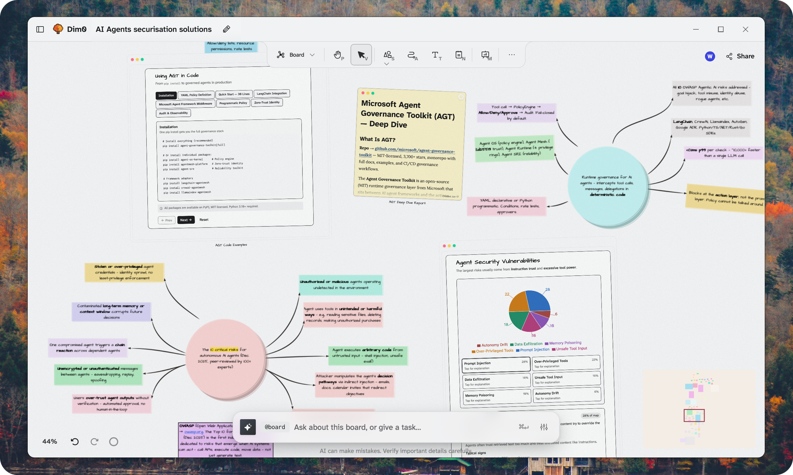
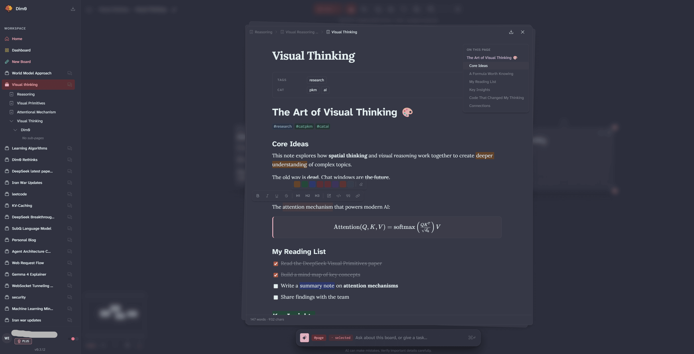
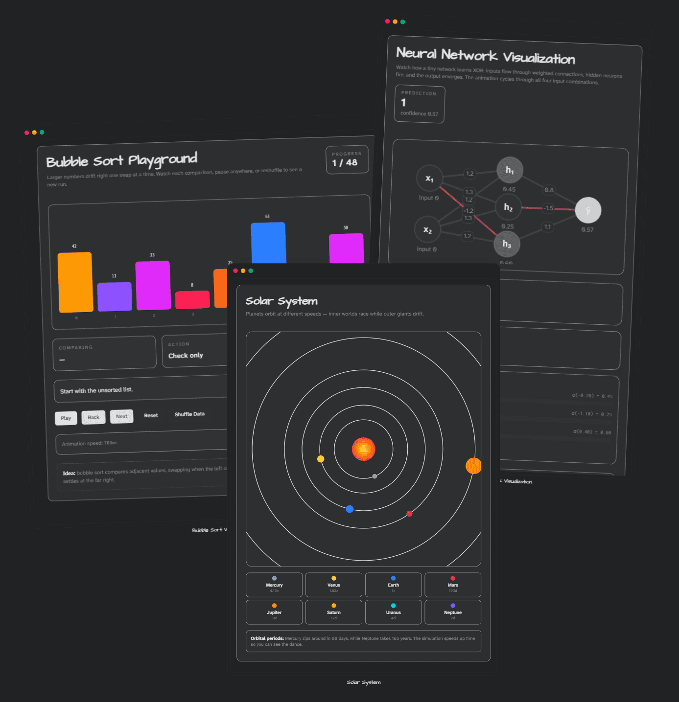
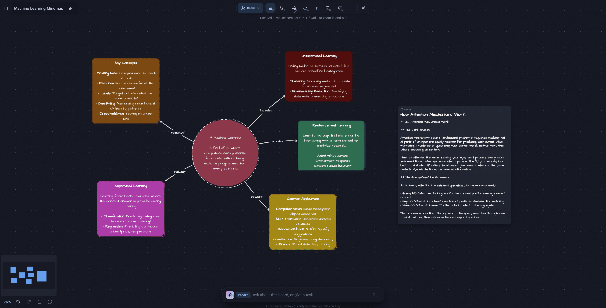
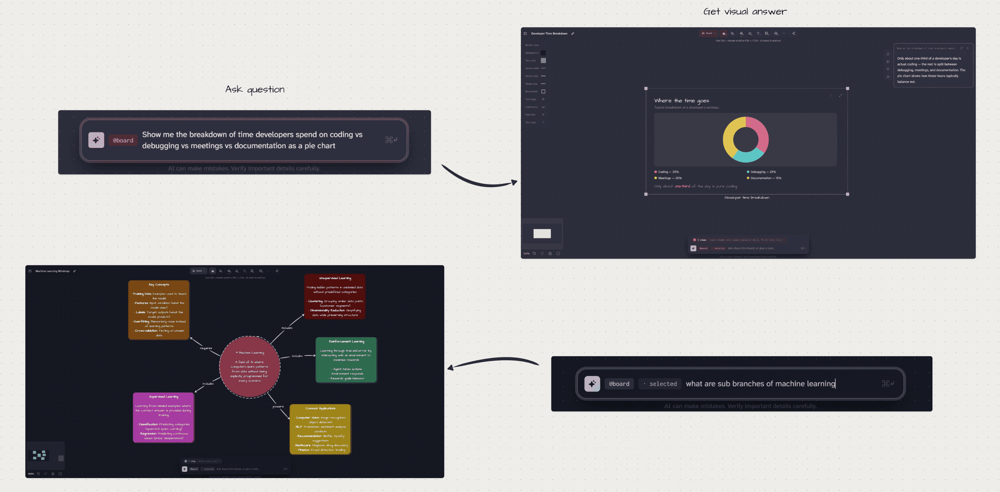

<p align="center">
  
</p>

<h1 align="center">Dim0, The Thinking Canvas</h1>

<p align="center">
  <a href="https://github.com/vcmf/dim0/releases"></a>
  <a href="https://github.com/vcmf/dim0/actions/workflows/tests.yml"></a>
  <a href="https://github.com/vcmf/dim0/pulse"></a>
  <a href="./LICENSE"></a>
  <a href="https://app.dim0.net"></a>
</p>

<p align="center">
  <a href="https://dim0.net">🌐 Website</a> · <a href="https://app.dim0.net">🚀 Live App</a> · 🤝 Real-time collab · 🔒 Privacy-first · 📄 MIT
</p>

<p align="center">
  <strong>Your canvas thinks back.</strong><br />
  Notes, mini-apps, and an AI agent on one infinite, real-time board. The agent reads what's on the canvas and writes its results right back onto it.
</p>

<p align="center">
  ⭐ Star if Dim0 is useful to you. It genuinely helps others find the project.
</p>


*A single board: notes, a mind map, mini-apps, documents, and the agent - all in the same workspace.*

## Features

- ♾️ **Infinite canvas**: thousands of nodes and nested boards, smooth at scale
- 🎨 **A real whiteboard underneath**: hand-drawn and geometric shapes, arrows, images and media, and a huge icon library (200,000+ via Iconify)
- 🤖 **Board-aware agent**: reads your canvas and selected nodes, takes multi-step tool actions, and writes results back as editable nodes
- 🧩 **Mini-apps**: describe a tool, get a real interactive React app on the board: open it, edit it, export it
- 📝 **Rich notes**: Notion-style rich text, math, code, and sub-pages, edited in place
- 💻 **Code & documents**: run code in sandboxes; drop in files that the agent can search (RAG)
- 🖼️ **Audited AI image generation**: create and edit images from synced canvas nodes, with model-aware defaults, ordered references, immutable results, and provider-reported usage history
- 🔌 **Bring your own model**: OpenAI, Anthropic, Gemini, Mistral, DeepSeek, Qwen, and more, switch anytime
- 👥 **Real-time multiplayer**: live cursors, shared edits, a shared agent; conflict-free sync, solo or fifty people deep
- 🎬 **Present from the canvas**: drop frames on the board and run them as a slideshow, no export to a separate slides tool
- 🔓 **Open-source & private**: MIT, self-hostable, your data stays yours (no training, no telemetry)

See it in action:

https://github.com/user-attachments/assets/cdc7d3d4-eb59-4d7d-a9ff-6f0206ba82df

## Why Dim0?

You already have a chat assistant, a whiteboard, and a doc tool. Dim0 is what you get when they're the *same* surface, and the AI can actually touch it.

| | **Dim0** | ChatGPT / Claude artifacts | Notion + AI | Miro / tldraw / Excalidraw |
| --- | :---: | :---: | :---: | :---: |
| Infinite spatial canvas | ✅ | ❌ | ❌ | ✅ |
| Agent reads the workspace & writes back | ✅ | ⚠️ chat only | ⚠️ doc only | ❌ |
| Mini-apps: real, editable, persistent React apps | ✅ | ⚠️ trapped in thread | ❌ | ❌ |
| Rich notes (math, code, sub-pages) on the canvas | ✅ | ❌ | ⚠️ docs, not canvas | ❌ |
| Real-time multiplayer | ✅ | ❌ | ✅ | ✅ |
| Bring-your-own model (Claude, GPT, Gemini, …) | ✅ | ❌ | ❌ | ❌ |
| Open-source & self-hostable | ✅ | ❌ | ❌ | ⚠️ partial |
| Your data stays yours (no training, no telemetry) | ✅ | ❌ | ❌ | ⚠️ |

**The short version:** mini-apps and agent output *live on the board* next to your notes and data (editable, persistent, and shared with your team in real time), instead of being buried in a chat thread you'll never find again.

## Quickstart

Run the published images. Docker is the only prerequisite.

```bash
git clone https://github.com/vcmf/dim0.git && cd dim0
cp .env.sample .env          # then set the three keys below
make pull && make run        # pulls latest images and starts everything
```

Set these three in `.env` before `make run`:

| Key | What it powers |
| --- | --- |
| `OPENAI_API_KEY` | the agent's default model + embeddings |
| `OPENROUTER_API_KEY` | access to the other language models and server-side AI image generation |
| `LINKUP_API_KEY` | web search & page fetch |

Open **http://localhost:3000** → create a board → type a prompt. Done.

Stop it with `make down-run` (add `make kill-run` to wipe volumes).

> Want to hack on the source instead of the images? See **[Run from source](#run-from-source)** below.

## Desktop app

Prefer a native app? Dim0 ships a standalone desktop build (macOS · Linux · Windows) that runs **fully local and offline on your own keys** — boards live on-device and the agent calls providers directly. Sign in to use managed AI and sync boards across devices.

**macOS / Linux**

```bash
curl -fsSL https://raw.githubusercontent.com/vcmf/dim0/main/install.sh | sh
```

**Windows** (PowerShell)

```powershell
irm https://raw.githubusercontent.com/vcmf/dim0/main/install.ps1 | iex
```

The install scripts fetch the latest release from your terminal, so the app launches **without a Gatekeeper / SmartScreen prompt** (it's ad-hoc signed; not yet notarized). You can also grab installers straight from the [Releases page](https://github.com/vcmf/dim0/releases) — a browser download shows the usual first-run security prompt until we notarize.

## What it is

Most AI tools start with a chat box and bolt the rest of the product on around it. Dim0 goes the other way - the board is the workspace, and the agent is one of the things living on it.

The board holds notes, code sandboxes, mini-apps, documents, nested boards, and presentation frames, all sitting next to each other - and your whole team can be on it at once. The agent can see what's there, take multiple steps with tools, and drop its results back onto the same canvas.

## Node types

Everything on the board is a node:

- **Shapes** - diagrams and spatial structure
- **Notes** - rich text, edited in place
- **Code sandboxes** - write code, run it
- **Mini-apps** - real, interactive React apps: calculators, charts, visualizers, quizzes
- **Documents** - uploaded files, also fed into retrieval
- **Image generators and results** - server-generated images, ordered visual references, and immutable result nodes
- **Nested boards** - for when one board isn't enough
- **Frames** - turn the canvas into a presentation


*Shapes for diagrams, flowcharts, and spatial layout.*


*Notes are first-class - rich text, math, code, edited in place.*


*Describe a tool and Dim0 builds a real, interactive app - it lives on the board, reads the data next to it, and you can open, edit, and export the React code.*


*Mix shapes and notes to think through a topic spatially.*

https://github.com/user-attachments/assets/ad5de9f4-6f44-43a2-b59a-5279232d7f60

## AI image generation

Dim0 can generate or edit images directly from a synced board. Provider calls run only in the backend: the browser sends a model ID, prompt, validated options, and internal asset IDs, while the server owns the OpenRouter credential, resolves reference bytes, records the attempt, and stores the result as an immutable board asset.

Successful generations create a dedicated result node on the canvas. Deleting that node does not delete its audit record or asset, and an editor can recreate the canonical result node from the generator when necessary.

### Setup

1. Copy the environment template if you have not already done so:

   ```bash
   cp .env.sample .env
   ```

2. Add an OpenRouter key to the root `.env`:

   ```dotenv
   OPENROUTER_API_KEY=your_server_side_key
   ```

   Keep this variable server-side. Do not rename it with a `VITE_` prefix, place it in canvas data, or expose it through a frontend build.

3. Build and start the source stack:

   ```bash
   make up-build PROFILE=local
   ```

   If the stack is already running, restart the backend after changing `.env`. Rebuild the web UI when switching to a commit that changes the generator interface.

4. Verify that the backend publishes the current model catalog (the default API port is `8081`):

   ```bash
   curl -fsS http://localhost:8081/image-models
   ```

The catalog is the authoritative source for model IDs, selectable options, reference limits, and Dim0 defaults. The current registry includes:

- `x-ai/grok-imagine-image-2.0`
- `microsoft/mai-image-2.5-pro`
- `google/gemini-3-pro-image`
- `qwen/qwen-image-3-pro`
- `google/gemini-3.1-flash-image`
- `bytedance-seed/seedream-5-0-pro`

OpenRouter availability, capabilities, and pricing can change. Check the returned catalog and your OpenRouter account before production use; provider charges apply to successful or otherwise billable provider requests.

### Use an image generator node

1. Sign in and open a **synced** board. New boards start on-device; use **Enable sync** before generating images. Local-only boards never call the server-side image provider.
2. Open **More actions**, select **Image generator**, then drag on the canvas to place the node.
3. Wait for the model list to load and enter a non-empty prompt. The **Generate** button remains disabled until the board is editable, the catalog is available, and the prompt is valid.
4. Choose a model and, when advertised by that model, an aspect ratio, resolution, and quality. Omitted or stale values are replaced with the selected model's explicit server default; unsupported controls are not invented.
5. Optionally add PNG, JPEG, or WebP reference images. Reference order is preserved. Requests above the selected model's limit are rejected rather than silently truncated.
6. Select **Generate**. Dim0 records the run and attempt before contacting OpenRouter, polls the durable status, and adds the successful result to the canvas.
7. Use the result node to open or download the original image. Use **AI image history** in the workspace sidebar to inspect status, references, output, timestamps, and provider-reported usage and cost.

### Audit, visibility, and security

- Generation runs and provider attempts are durable and move through explicit lifecycle states. A failed attempt is preserved; ambiguous provider timeouts are not automatically retried with a new request ID.
- Uploaded references and generated outputs share the same internal asset system. Reference snapshots retain the request-time MIME type, dimensions, size, hash, storage key, and ordinal.
- Asset downloads are authenticated and returned with private, no-store, and `nosniff` headers. Arbitrary external URLs and browser file paths are not accepted as provider inputs.
- API keys, authorization headers, raw provider bodies, base64 image payloads, and storage paths are excluded from API responses and audit views.
- The current **AI image history is global and read-only**: every authenticated Dim0 user can inspect all creators' prompts, private board labels, reference originals, generated results, and provider-reported usage/cost. Treat a deployment as a trusted workspace unless you change this product policy for a multi-tenant environment.

### Troubleshooting

- **Image generator is missing:** the current board is probably local-only. Sign in and enable sync.
- **Model selector is temporarily empty:** wait for `/image-models` to finish loading. If it stays empty, verify the API origin and inspect the backend response.
- **Generate is disabled:** enter a prompt, confirm you have edit permission, remove excess references, and wait for any active or recoverable request to finish.
- **Provider configuration error:** confirm `OPENROUTER_API_KEY` exists in the backend environment and restart the backend. Never print the key while diagnosing it.
- **A request appears stuck:** use the node's status action first. Do not create a new request ID after an ambiguous response, because the provider may already have received and billed the original request.

## Canvas engine

The board is built on [canvas-harness](https://github.com/winlp4ever/canvas-harness), a canvas-rendered node-graph library we maintain separately. Boards can hold thousands of nodes and still pan, zoom, and edit smoothly, comparable to tldraw and Excalidraw, and on par with hosted tools like Miro or FigJam.

## Collaboration

Every board is real-time multiplayer. Live cursors, shared edits, and a shared agent - the same board works identically whether you're solo or fifty people deep. Edits sync over WebSocket with operational transforms, so concurrent changes merge without conflicts or lost work.

It's the same canvas either way: no separate "shared mode," no export-to-collaborate step. Open a board, send the link, work together.

## Agent layer

Built on the OpenAI Agents SDK, with board-aware tools wired in:

- Board context - current graph and selected nodes
- Notes - create, edit, link
- Web - search and fetch
- Code - run in Daytona-backed sandboxes
- Mini-apps - generate real, interactive React apps inline
- Memory - semantic store and recall, via Qdrant

Models: OpenAI, Anthropic, Google Gemini, Mistral, Moonshot, DeepSeek, Qwen, Z.ai.


*Ask a question on the board - the agent answers with a mini-app, a mindmap, or a note, dropped back where you're working.*

## Themes

Light, dark, and a set of paper-and-ink variants. The canvas adapts; so do notes, mini-apps, and shapes.


*A few of the available themes.*

## Try it

- Hosted: https://app.dim0.net
- Site: https://dim0.net
- Self-host: see below

## Repo layout

- `backend/` - API, agent logic, prompts, model integrations, persistence
- `webui/` - React frontend (canvas, chat, board UX)
- `build/` - Docker Compose and build helpers

## Getting started

### Prerequisites

- Node.js (LTS)
- `uv` for Python deps
- Docker + Docker Compose (recommended for local services)

### Environment

Copy `.env.sample` to `.env` and fill in the keys. The three required keys are covered in [Quickstart](#quickstart); the rest of `.env.sample` adds more providers and tools.

```bash
cp .env.sample .env
```

A couple of things worth knowing:

- Backend and frontend both read the root `.env`
- Only variables prefixed with `VITE_` reach the frontend

### Run from source

If you'd rather run the source instead of the published images:

#### Local databases

```bash
make up-db
```

#### Backend

```bash
cd backend
uv sync
uv run python -m topix.api.app
```

Port comes from `API_PORT` in `.env` (defaults to `8081`).

#### Frontend

```bash
cd webui
npm install
npm run dev
```

Port comes from `APP_PORT` in `.env` (defaults to `5175`).

## Environment variables

`.env.sample` is the canonical list - ports and origins, model provider keys, search and image provider keys, local service settings, backend auth and tracing. Use it as a checklist when setting things up.

## Docker

Compose stack with Makefile shortcuts.

### Core commands

| Command | What it does |
| --- | --- |
| `make up` | Build if needed and start all services |
| `make up-build` | Rebuild images, then start |
| `make build` | Build images only |
| `make rebuild` | Rebuild without cache |
| `make down` | Stop and remove containers |
| `make kill` | Stop and remove containers, images, and volumes |

### Services and debugging

| Command | What it does |
| --- | --- |
| `make ps` | Show service status |
| `make logs` | Tail logs for all services |
| `make logs-s SERVICE=backend-dev` | Tail logs for one service |
| `make up-s SERVICE=backend-dev` | Start one service |
| `make build-s SERVICE=webui-dev` | Build one service |
| `make restart-s SERVICE=backend-dev` | Rebuild and restart one service |
| `make exec SERVICE=backend-dev CMD="bash"` | Open a shell in a service |

### Databases

| Command | What it does |
| --- | --- |
| `make up-db` | Start only the databases |
| `make down-db` | Stop only the databases |

### Overrides

Override the profile and env file at invocation:

```bash
make up PROFILE=local ENVFILE=.env
```

Or override ports and origins for quick tests:

```bash
make up PROFILE=dev API_PORT=9090 API_HOST_PORT=9090 API_ORIGIN=http://localhost:9090
```

## Images

Public Docker Hub images, for self-hosting:

- `winlp4ever/dim0-backend`
- `winlp4ever/dim0-webui`

```bash
docker pull winlp4ever/dim0-backend:latest
docker pull winlp4ever/dim0-webui:latest
```

Pin a specific release (see [Releases](https://github.com/vcmf/dim0/releases) for the current version) by swapping `latest` for a tag, e.g. `:0.3.41`. To run them locally, use the `make pull` / `make run` flow above.

## Versioning

One semver for the whole product. The repo-root `VERSION` file is the source of truth, and release tooling syncs it into:

- `backend/pyproject.toml`
- `webui/package.json`
- `webui/src-tauri/Cargo.toml`

Bumps use Commitizen with Conventional Commits.

```bash
make version-check
make version-sync
make version-bump
```

GitHub Actions handle the version check, releases, and Docker publishing.

## Troubleshooting

- Frontend can't reach the API? Check `VITE_API_URL` in `.env`.
- Port already in use? Change `API_PORT` or `APP_PORT`.
- Env change not picked up? Restart backend and frontend after editing `.env`.
- Want to see the resolved Compose config? `make config`.
- Backend tests failing with odd import errors (e.g. `cannot import name 'Docstring' from 'griffe'`)? The local `backend/.venv` is stale or half-installed, and a plain `uv sync` won't repair a partially-deleted package. Rebuild it: `rm -rf backend/.venv && uv sync --extra dev`.

## Contributing

Issues and pull requests are welcome. See [CONTRIBUTING.md](./CONTRIBUTING.md) to get started.

## License

MIT.
