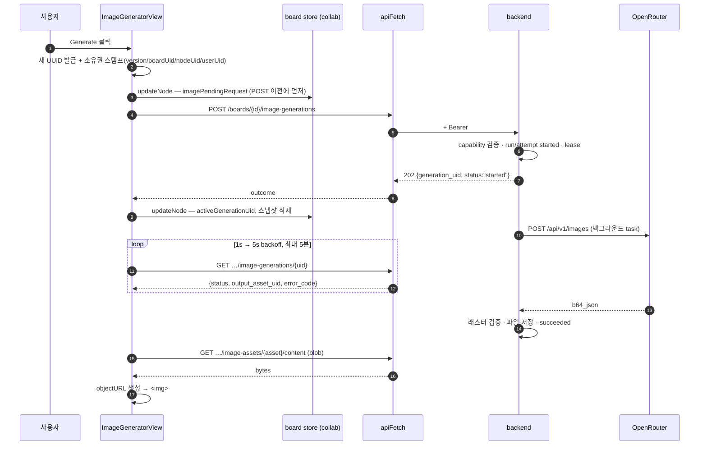
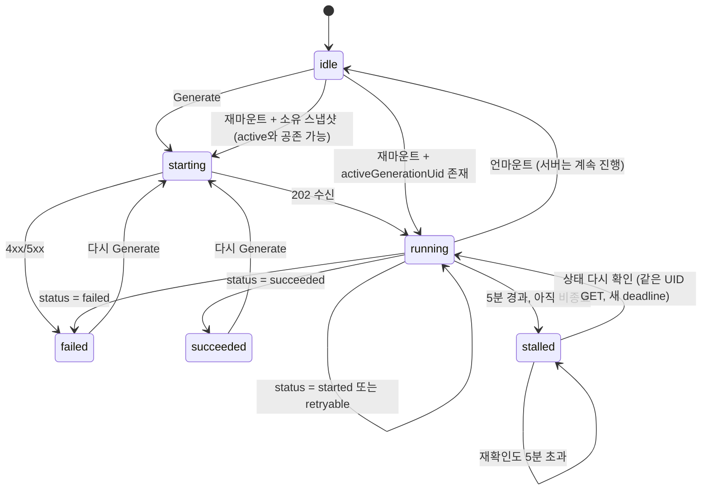

# PR-03 — Image Generator Node

캔버스 위에서 프롬프트를 쓰고 AI 이미지를 생성하는 first-party 노드를 구현하기 위한 명세.

- **base**: `main` @ `c6e18b9` (PR-01·PR-02 병합 완료)
- **scope**: frontend + `webui/src/api.ts` blob mode + backend Pydantic contract test
- **est.**: 신규 7 · 수정 12 · 테스트 6 파일 / ~1,250 LOC

---

## 0. 결론 요약

### 작업 브랜치

승인된 구현 브랜치는 `feat/pr-03-image-generator-node`다. 새 브랜치를 만들지 않고
이 브랜치에서 구현과 Draft PR을 완료한다.

### 아키텍처 — C안

host React에서 도는 first-party `image-generator` custom node. mini-app iframe을 쓰지 않는다. 사용자에게는 "캔버스 위의 app"으로 보이되 내부는 일반 React 컴포넌트다. **백엔드·DB 변경 없음.**

### OpenRouter 키 — 무료 검증과 Draft PR 이후 별도 승인

PR-02는 병합됐지만 실제 provider와 **한 번도 통신한 적이 없다**. 무료 자동
검증과 Draft PR 생성을 먼저 완료하고, 약 **$0.04**짜리 실호출 1회에 대해 사용자
승인을 별도로 받는다. 승인 전에는 OpenRouter를 호출하지 않는다.

---

## 1. 이미 만들어져 있고 그대로 쓰는 것

PR-01과 PR-02가 서버 쪽을 전부 끝내놨다. PR-03은 UI 한 겹만 얹는다.

| 자산 | 위치 | 역할 |
|---|---|---|
| `GET /image-models` | `api/router/image_generation.py` | 모델·옵션 목록. 정적 allowlist |
| `POST /boards/{graph_id}/image-generations` | 동일 | 생성 시작 → 202 + `generation_uid` |
| `GET …/image-generations/{uid}` | 동일 | 폴링. status·output·error 일체 |
| `GET …/image-assets/{uid}/content` | 동일 | 결과 바이트. 인증 필요 |
| worker lease · reconciliation | `store/postgres/image_generation.py` | 좌초된 run 정리 |
| 멱등성 `(user, board, client_request_uid)` | `build/schema.sql` | 중복 방어. **UI가 반드시 활용** |
| `verify_board_member_can_edit` | `api/utils/security.py` | viewer 차단 |
| capability registry | `image_generation/capabilities.py` | OpenRouter 라이브 값과 실측 일치 |

### 프론트엔드 재사용 부품

| 부품 | 모듈 |
|---|---|
| `defineNode` | `@canvas-harness/core` |
| `useNode`, `useCanvasStore` | `@canvas-harness/react` |
| `NodeTrafficLights`, `NodeTitleCaption`, `NodeFooter` | `harness/shared-views` |
| `useIsInView`, `useStopCanvasGesture`, `NodeErrorBoundary` | 동일 |
| `useBoardAppStore` → `canEdit` | `harness/store/board-app-store.ts` |
| `apiFetch` | `webui/src/api.ts` |

`NodeFooter`는 `status?: "idle" | "pending" | "saving" | "saved" | "error"` pill을 이미 렌더한다.

---

## 2. 검증된 사실

| 사실 | 근거 | 설계 영향 |
|---|---|---|
| **mini-app state는 사용자별** | `mini_app_state` PK `(note_uid, user_uid)`; docstring "Per-user, per-note JSON blob" | **A/B 기각.** 생성 상태를 다른 학생이 볼 수 없다 |
| **host RPC는 2개뿐** | `mini-app/dispatch.ts`: `saveState`, `toast`. 주석 — `callTool`/`openNote`는 "dropped … until they have real implementations" | **B 기각.** 유료 호출 RPC 추가는 팀이 좁혀온 방향과 반대 |
| **격리는 CSP가 아니라 opaque-origin 샌드박스** | `runtime-target.ts:32` — `SANDBOX = SINGLE_FRONTEND ? "allow-scripts" : "allow-scripts allow-same-origin"`. `connect-src`는 저장소 어디에도 없음 | cross-origin 모드에서는 iframe이 실제 origin을 가진다 |
| **`mini-app`은 그 자체가 custom node** | `node-types/index.ts` → `miniAppDef` | **C 채택.** 새 패턴이 아니라 iframe만 뺀 것 |
| **`apiFetch`는 envelope를 벗기지 않는다** | `api.ts:243` — `res.json()`을 `TResponse`로 반환 | bare response에 어댑터 **불필요** |
| **노드 속성은 `extra='allow'`지만 값은 `DataProperty`여야 한다** | `datatypes/resource.py:29` + `__pydantic_extra__: dict[str, DataProperty]` | `TextProperty`/`KeywordProperty`만 쓰면 **백엔드·DB 변경 0** |
| **노드 id는 생성 시 동기 반환** | `use-add-image.ts:89` — `const id = store.addNode(...)` | `generator_node_uid` 즉시 확보 |
| `provider_request_id` 위치 | T2I body에는 없었고 PR-04 I2I에서 `x-generation-id` header를 확인 | nullable audit field로 body ID 우선·header fallback 사용 |

---

## 3. 아키텍처 결정

### C안 — first-party custom node

| 기준 | A · mini-app | B · mini-app + RPC | C · custom node |
|---|---|---|---|
| 서버 API 직접 호출 | 불가 (opaque origin) | host 경유만 | **가능** (`apiFetch`) |
| 유료 호출 권한 통제 | 해당 없음 | **임의 코드에 노출** | **first-party만** |
| board 공유 상태 | 불가 (per-user) | **신규 저장소 필요** | **node data → collab** |
| generator node UID | 간접 | RPC 추가 필요 | **동기 확보** |
| PR-04 edge 조회 | RPC 필요 | RPC 필요 | **store 직접** |
| PR-05 결과 노드 | RPC 필요 | RPC 필요 | **store 직접** |
| 메모리 | ~5MB/노드 | ~5MB/노드 | **일반 React** |
| 테스트 | iframe 브리지 모킹 | RPC + iframe | **RTL 표준** |
| upstream 충돌 | 낮음 | **높음** (코어 브리지) | 낮음 |

**A 기각 이유**는 능력이 아니라 상태 모델이다. **B 기각 이유**는 임의 mini-app 코드가 유료 생성을 호출할 수 있게 된다는 것 하나로 충분하다.

### PR-03에서 하지 않는 것

- 참조 이미지 (PR-04). 단 API 시그니처에 `referenceAssetUids`를 넣고 항상 `[]`를 넘긴다.
- 결과 캔버스 노드 자동 생성 (PR-05). 카드 안에 preview만 그린다.
- 확장 surface / URL 라우팅. `NodeSurfaceKind`와 `use-surface-from-url`은 **건드리지 않는다**.
- 실시간 전파 (PR-05).

### 로컬 보드에서는 노드를 만들 수 없어야 한다

Dim0에는 서버에 동기화되지 않는 **로컬 전용 보드**가 있다. 실제 렌더 경로는
`LocalBoardScreen`의 `<HarnessCanvas local />`이며, synced board는 기본
`<HarnessCanvas />`를 사용한다. 이 기존 prop을 작은 React context로 custom view에
전달한다. 로컬 보드도 **같은 custom node 렌더 경로를 쓴다.**

이미지 API는 서버 board ID와 인증 토큰을 요구하므로, 로컬 보드에서 만든 노드는 404/403으로 죽는다.

**PR-03 필수 처리:**

- **툴바에서 숨기거나 비활성화** — 로컬 보드에서는 Image Generator 항목이 보이지 않거나, 눌리지 않고 이유를 알려준다.
- **기존 노드 안내** — import·복제로 로컬 보드에 노드가 들어왔다면 폼 대신 "서버 보드에서만 사용할 수 있습니다"를 렌더한다. 실패하는 요청을 보내지 않는다.
- **테스트** — Generate 비활성 여부, 안내 렌더 여부.

> **술어를 지어내지 말 것.** 새 전역 상태나 추정 ID 규칙을 만들지 않고,
> `HarnessCanvas`가 이미 받는 실제 `local` prop을 source of truth로 쓴다.

---

## 4. OpenRouter 키 투입 시점

### 결론: 무료 검증과 Draft PR 뒤 승인을 받아 Dim0 API 경유로 1회 확인한다

| 항목 | 상태 | 위험 |
|---|---|---|
| 모델 ID 3종 실재 | 문서·카탈로그 확인 | — |
| 참조 한도 3 / 1 / 14 | endpoints 실측 일치 | — |
| `data[].b64_json` / `media_type` | 공식 문서 명시 | 낮음 |
| `usage.cost` 필드명 | 공식 문서 명시 | 낮음 |
| 옵션이 top-level인지 | 공식 문서 명시 | 중간. 틀리면 옵션이 조용히 무시됨 |
| `input_references` 중첩 형태 | 공식 문서 명시 | 중간. 틀리면 I2I 전량 실패 (PR-04에서 발현) |
| `provider_request_id` 위치 | T2I body에는 없었고 PR-04 I2I header에서 확인 | nullable이며 body ID 우선·검증된 header fallback 사용 |
| 에러 응답 형태 | 미확인 | 낮음. 방어적 파싱이라 안전 |
| 파이프라인 완주 (저장·감사·MIME) | **미검증** | **높음.** 한 번도 끝까지 돌아본 적 없음 |

**왜 코딩 전이 아니라 병합 전인가.** OpenRouter 응답 형태는 **PR-03 UI에 보이지 않는다.** `b64_json`도 `usage.cost`도 어댑터 내부에서만 쓰이고, UI가 다루는 것은 Dim0 자체 API의 응답 — 즉 PR-02의 Pydantic 모델(`ImageGenerationStatusResponse` 등)로 레포 안에 이미 확정된 형태다. 따라서 PR-03의 mock 픽스처는 provider 계약과 무관하게 지금 정확히 쓸 수 있다. 실호출이 검증하는 것은 *파이프라인이 끝까지 완주하는가*이지 UI 계약이 아니다.

무료 테스트와 Draft PR 작성·검토는 유료 호출 전에 완료할 수 있다. 다만 **사용자가
명시적으로 승인한 Dim0 API 전체 경로 T2I smoke가 성공하기 전에는 Draft를 Ready로
전환하거나 merge하지 않는다.** CI는 OpenRouter 키를 요구하거나 외부 유료 API를
호출하지 않는다.

### 비용

`x-ai/grok-imagine-image-2.0`, quality `low`, resolution `1K` — **이미지당 $0.04**. T2I 1회면 충분하다.

이 smoke의 성공 조건은 특정 파일 형식을 강제하는 것이 아니라 PR-01 → PR-02 →
PR-03 전체 경로가 실제 provider 결과를 안전하게 검증·저장·감사·서빙하는지 확인하는
것이다. 허용된 provider raster 형식은 PNG/JPEG/WebP이며, 실제 바이트 검사 결과와 MIME,
확장자, dimensions, byte size, SHA-256, DB asset 정보, 인증 다운로드의 HTTP
`Content-Type`이 모두 일치해야 한다.

### 절차

**1. 서버 `.env`에만 넣는다**

```
# backend 프로세스가 읽는 .env — 저장소에 커밋 금지
OPENROUTER_API_KEY=sk-or-v1-...
```

`VITE_` 접두사를 절대 붙이지 않는다. 붙는 순간 번들에 들어가 브라우저로 나간다.

**2. CI에는 넣지 않는다**

GitHub Actions secrets에 추가하지 않는다. CI가 유료 API를 호출할 경로가 하나도 없어야 한다.

**3. 사용자에게 명시적 승인을 받는다**

유료 호출이다. 실행 직전에 모델·해상도·예상 비용을 알리고 승인을 받은 뒤에만 실행한다.

**4. Dim0 API를 통과시켜 1회 실행**

OpenRouter에 직결하지 말고 **서버 API 전체 경로**로 보낸다. 어댑터만이 아니라 래스터 검증·content-addressed 저장·asset row·감사 레코드·상태 전이·인증 다운로드까지 같은 비용으로 검증된다.

```bash
BOARD=<graph_uid>;  TOKEN=<access token>;  API=http://localhost:8000

# 1) 시작
GEN=$(curl -sS -X POST "$API/boards/$BOARD/image-generations" \
  -H "Authorization: Bearer $TOKEN" -H "Content-Type: application/json" \
  -d '{"client_request_uid":"'"$(uuidgen)"'",
       "model_id":"x-ai/grok-imagine-image-2.0",
       "prompt":"<bounded T2I smoke prompt>",
       "parameters":{"resolution":"1K","quality":"low","aspect_ratio":"1:1"},
       "reference_asset_uids":[],"generator_node_uid":null}' \
  | tee /dev/stderr | python3 -c 'import sys,json;print(json.load(sys.stdin)["generation_uid"])')

# 2) 종료까지 폴링
until curl -sS "$API/boards/$BOARD/image-generations/$GEN" \
        -H "Authorization: Bearer $TOKEN" | tee /tmp/gen.json \
        | grep -qE '"status":"(succeeded|failed)"'; do sleep 3; done
cat /tmp/gen.json

# 3) 인증된 결과 바이트를 실제로 받아본다
ASSET=$(python3 -c 'import json;print(json.load(open("/tmp/gen.json"))["output_asset_uid"])')
curl -sS "$API/boards/$BOARD/image-assets/$ASSET/content" \
  -H "Authorization: Bearer $TOKEN" -o /tmp/out.image -D /tmp/hdr.txt
file /tmp/out.image; grep -i 'content-type\|cache-control' /tmp/hdr.txt
```

**5. 전체 경로를 확정하고 기록한다**

- 상태가 `succeeded`로 끝나는가 — 파이프라인 완주 여부
- `/tmp/out.image`가 PNG/JPEG/WebP 중 하나이고 실제 바이트와 MIME이 일치하는가
- 저장 확장자, dimensions, byte size, SHA-256, DB asset metadata가 일치하는가
- 인증 다운로드의 HTTP `Content-Type`이 실제 MIME과 일치하는가
- DB의 `image_generation_attempt`에 `usage`·`cost_usd`·`latency_ms`가 채워졌는가
- generation/attempt 상태 전이와 reference 순서가 보존됐는가
- 같은 client request에 generation/attempt가 하나뿐이고 provider 중복 호출이 없는가
- API 응답·DB·로그에 secret, provider 오류 원문, base64 이미지가 노출되지 않는가
- `provider_request_id`는 공식 OpenRouter Image API 성공 응답에서 보장되지 않는 nullable
  필드이므로 NULL이어도 smoke 성공이다
- sanitized 실패는 mock/integration 테스트로 검증한다. 존재하지 않는 model ID는
  capability 검증에서 provider 호출 전에 422가 될 수 있으므로 별도 live failure
  audit 검증으로 간주하지 않으며, 추가 유료 실패 호출은 별도 승인 없이 실행하지 않는다.

```bash
psql -c "SELECT status, provider_request_id, cost_usd, latency_ms, usage
         FROM image_generation_attempt ORDER BY started_at DESC LIMIT 2;"
```

**6. 2026-08-22 실호출 결과**

승인된 T2I smoke는 provider 호출 1회와 attempt 1회로 전체 경로를 완주했다. 결과는
1024×1024 JPEG, 190,555 bytes였고 실제 바이트 검사 결과, `image/jpeg`, `.jpg`
확장자, dimensions, byte size, SHA-256, DB asset metadata와 인증 다운로드의 HTTP
`Content-Type`이 모두 일치했다. generation run과 attempt는 모두 `succeeded`였고,
usage와 `$0.0400000000` cost가 기록됐다. 같은 client request의 generation과 attempt는
각각 하나뿐이어서 중복 과금이 없었으며 secret과 provider 원문도 노출되지 않았다.
`provider_request_id`는 NULL이었고 위 nullable 계약에 따라 정상 결과다.

예상하지 않은 JPEG가 반환됐을 때 Dim0는 provider 주장을 그대로 신뢰하거나 PNG로
오표기하지 않았다. 제한된 raster bytes를 검사해 실제 형식을 판별하고 올바른 MIME과
확장자로 저장·서빙했으므로 이 결과는 smoke의 핵심 목적에 대한 검증 성공이다.

**7. PR-02 후속 소형 수정 결과**

광고되지 않은 `output_format="png"` 강제 전송은 제거됐다. 향후 출력 형식 선택이
필요하면 하드코딩하지 않고 `supported_output_formats` 같은 모델 capability와 기존
검증 경로를 통해서만 노출한다.

T2I smoke에서는 body ID가 없었고, PR-04 I2I smoke에서는 성공 body의 `created`, `data`,
`usage`와 response header의 `x-generation-id`를 확인했다. 현재 adapter는 bounded body ID를
우선하고 없을 때만 같은 길이·공백 검증을 거친 case-insensitive header 값을 사용한다.
이 값은 감사 필드에만 저장하며 로그나 클라이언트 응답에는 노출하지 않는다. 이 계약
정리만을 위한 추가 유료 smoke는 수행하지 않는다.

> **테스트 금칙.** PR-03 테스트에서 네트워크를 타는 코드가 하나도 없어야 한다. OpenRouter 실호출은 위 수동 절차에서만 일어난다.

---

## 5. 데이터 모델과 상태 소유권

### 공유 node data — `NoteProperties` optional 필드

| 필드 | Property | 목적 | 생명주기 |
|---|---|---|---|
| `imagePrompt` | `TextProperty` | 사용자 프롬프트 | 영구 |
| `imageModelId` | `KeywordProperty` | 선택 모델 | 영구 |
| `imageAspectRatio` | `KeywordProperty` | 비율 | 영구 |
| `imageResolution` | `KeywordProperty` | 해상도 | 영구 |
| `imageQuality` | `KeywordProperty` | 품질 | 영구 |
| `activeGenerationUid` | `KeywordProperty` | 마지막으로 서버가 확인한 생성·결과 | 영구 (**새 202 수신 시에만 교체**) |
| `imagePendingRequest` | `TextProperty` (canonical JSON) | 아직 202를 확인하지 못한 새 시작 요청 | **202 또는 확정적 사전 거부 시 빈 sentinel로 clear** |

두 필드는 동시에 존재할 수 있다. `activeGenerationUid`는 기존 preview를 보존하고,
`imagePendingRequest`는 새 POST의 복구 상태를 소유한다. 이전 active의 polling 결과는
새 pending을 clear하거나 그 phase/error를 덮어쓸 수 없다.

`phase`(`idle`/`starting`/`running`/`succeeded`/`failed`/**`stalled`**)는 **저장하지 않는다.** 전부 React state다. 특히 `stalled`는 *이 브라우저의 폴링 타이머*가 만들어낸 클라이언트 전용 판단이므로, 저장하면 한 사람의 타이밍이 같은 보드의 모두에게 "멈췄다"로 전파된다. 서버는 그동안 정상 진행 중일 수 있다.

> **중첩 객체를 쓰지 말 것.** 백엔드 `ResourceProperties`는 `extra='allow'`지만 extra 값의 타입이 `dict[str, DataProperty]`로 제약된다. `{ clientRequestUid, modelId, prompt, parameters }` 같은 **중첩 객체를 그대로 넣으면 round-trip에서 깨진다.** 반드시 `TextProperty` 안에 JSON 문자열로 직렬화한다.
>
> ```ts
> imagePendingRequest: {
>   type: "text",
>   text: JSON.stringify({
>     version: 1, boardUid, generatorNodeUid, initiatorUserUid, // 소유권 스탬프 — 아래 참조
>     clientRequestUid, modelId, prompt, parameters,
>   }),
> }
> ```

협업 backend의 property patch는 deep merge이므로 key 삭제나 `undefined`는 기존 값을
지우지 못한다. pending과 active UID를 clear할 때는 각각 빈 `TextProperty`와 빈
`KeywordProperty`를 명시적으로 보내고, frontend reader가 빈 값을 `null`로 해석한다.
이렇게 해야 clear가 JSON wire와 backend Pydantic round-trip을 통과한다.

#### 스냅샷은 자기 소유를 증명해야 한다

스냅샷에 `version` · `boardUid` · `generatorNodeUid` · `initiatorUserUid`를 **반드시 함께 저장한다.** 이유:

보드를 통째로 복제하면 `imagePendingRequest`가 그대로 따라온다. 복제본에서 노드가 마운트되면 복구 로직이 발동해 **새 보드로 POST를 보낸다.** 유니크 키가 `(user_uid, board_uid, client_request_uid)`인데 board가 다르므로 충돌도 나지 않는다 — **요청하지도 않은 생성이 조용히 과금된다.** `activeGenerationUid`와 달리 스냅샷은 404로 걸러지지 않는다.

따라서 복구 전에 `version === 1 && boardUid === 현재 보드 && generatorNodeUid === 현재 노드 && initiatorUserUid === 현재 사용자`를 검사한다. version/board/node가 어긋나면 **네트워크 요청 없이 스냅샷을 폐기한다.** 사용자가 다르면 원 요청자의 복구 키를 보존하되 현재 사용자는 재전송하거나 clear하지 않는다. 사용자까지 확인해야 공유 보드를 연 다른 사용자가 원 요청자의 idempotency key를 자기 계정으로 재전송하는 일을 막을 수 있다.

이 가드가 **1차 방어선**이다. 실제 paste 경로는 `canvas-harness`가 내보내는 local
`node.add`를 `useStampNewNodes`가 구독하는 구조이므로, 그 구독자에서
`imagePendingRequest`만 제거하는 것을 2차 방어선으로 둔다. 자기 검증하는
스냅샷은 import 등 이 경로를 우회하는 입력에도 동작한다.

`activeGenerationUid`는 같은 보드 복제에서 유지한다. 복제본은 기존 generation과
결과를 GET으로만 조회하며, 사용자가 Generate를 명시적으로 누르기 전에는 새
generation을 만들지 않는다. 다른 보드에서는 board-scoped GET이 404일 수 있으며,
이때 결과 없음 상태로 정리하되 POST로 전환하지 않는다. 과금 위험이 있는 필드는
복구 POST를 유발할 수 있는 `imagePendingRequest`뿐이다.

### 설계 결정 1 — `outputAssetUid`를 저장하지 않는다

`activeGenerationUid` 하나로 `GET …/image-generations/{uid}`를 부르면 status·output_asset_uid·output_content_url·error가 전부 나온다. 따로 저장하면 서버 진실의 캐시가 하나 더 생기고 동기화 문제만 늘어난다. 같은 이유로 `status`도 저장하지 않는다.

### 설계 결정 2 — UUID만으로는 부족하다

멱등 키만 저장하면 이 경로에서 **409로 죽는다**: 요청 전송 → 202 유실 → *그 사이 프롬프트가 바뀜* → 새로고침 후 같은 UUID + 바뀐 내용으로 재전송 → 서버가 `request_fingerprint` 불일치를 감지 → `GenerationIdempotencyConflictError` → 409.

PR-02의 fingerprint는 `(model_id, prompt, parameters, reference_asset_uids, generator_node_uid)`로 계산된다. 따라서 **UUID가 아니라 요청 전체를 스냅샷**해야 실제 멱등성이 작동한다.

**노드가 board 공유라 위험이 더 크다.** 같은 사용자가 편집하지 않아도 된다 — 다른 학생이 프롬프트를 고치기만 해도 재시도가 409로 죽는다.

#### 스냅샷 규칙

| 상황 | 동작 |
|---|---|
| **Generate 클릭** (내용 무관) | **항상 새 UUID 발급** + 스냅샷 교체 |
| **마운트 복구** — 스냅샷이 이 보드·이 노드·현재 사용자 소유 | active 존재 여부와 무관하게 스냅샷을 **그대로 1회 재전송**. 새 UUID를 만들지 않는다 |
| **마운트 복구** — 스냅샷의 `version`/`boardUid`/`generatorNodeUid`가 어긋남 | **네트워크 요청 없이** 스냅샷 폐기 |
| **마운트 복구** — `initiatorUserUid`가 현재 사용자와 다름 | 원 사용자의 복구 키를 보존하고 POST·clear 모두 하지 않음 |
| **202 수신** | `activeGenerationUid` 저장 후 스냅샷을 빈 TextProperty로 **명시적 clear** |
| **400/401/403/404/422/429 수신** | run 생성 전 확정 거부이므로 pending만 clear하고 이전 active는 유지 |
| **typed reference-size 413 수신** | PR-04의 확정 거부 코드이면 pending만 clear하고 이전 active를 유지. 수정 후 명시적 Generate가 새 UUID 사용 |
| **transport/5xx** | 결과가 불명확하므로 active와 pending을 모두 유지. 명시적 재개는 같은 snapshot/UUID 사용 |
| **409 수신** | 같은 UUID가 다른 fingerprint에 묶인 확정 충돌. pending을 clear하고 안전한 충돌을 표시하며 자동 POST하지 않음 |

**클릭은 언제나 새 UUID다.** 이미지 생성은 비결정적이므로 같은 프롬프트로 다시 누르는 것은 *새 변형을 요청하는 정당한 행위*다. 내용이 같다고 기존 run을 돌려주면 사용자에게는 버튼이 고장 난 것으로 보인다.

**클라이언트에서 서버 fingerprint를 재구현하지 않는다.** 서버는 `{generator_node_uid, model_id, parameters(exclude_none=False), prompt, reference_asset_uids}`를 정렬해 해싱한다. 클라이언트가 이를 흉내 내면 필드 누락·키 순서·null 처리에서 조용히 어긋나고, 그 드리프트는 과금 오작동으로 나타난다. 스냅샷은 **오직 응답 유실·새로고침 복구용**이며 클릭 중복 제거에는 쓰지 않는다. 같은 세션의 더블클릭은 버튼 disabled로 막는다.

**409는 transport 실패가 아니다.** 서버는 동일 UUID·동일 fingerprint면 기존
generation을 202로 반환한다. 409는 동일 UUID가 *다른* fingerprint에 이미 묶였다는
확정 충돌이므로 같은 snapshot 재개는 무의미하다. blocking pending을 clear하되 자동
POST나 새 UUID 발급은 하지 않는다. 사용자가 오류를 확인한 뒤 Generate를 다시
명시적으로 눌렀을 때만 새 UUID로 새 변형을 시작한다. 이전 active 결과는 유지한다.

### 저장하지 않는 것

API 키, Authorization 헤더, provider 원문 응답, base64/data URL, 서버 파일 경로, `storage_key`, usage/cost.

### 로컬 UI 상태

드롭다운 open, 버튼 disabled, 폴링 타이머 id, `AbortController`, blob URL, 마지막 status 응답, 에러 문자열.

프롬프트는 타이핑 중 local draft로 유지하고 400ms trailing debounce로 공유 property에
반영한다. blur·unmount·Generate 직전에 flush하며, Generate snapshot과 저장 prompt는
항상 같은 최신 값을 쓴다. pending이 생기면 소유자와 무관하게 prompt·model·모든 옵션과
Generate를 잠그고, 아직 저장되지 않은 local draft timer는 취소한다. 협업은 기존
whole-value last-write-wins를 유지하며 새 CRDT나 고정 wire 메시지 수를 도입하지 않는다.

저장된 `imageModelId`가 현재 catalog에 없거나 T2I를 지원하지 않으면 첫 모델로 조용히
fallback하지 않는다. 명시적인 unavailable 상태에서 Generate를 막고 사용자가 다른 모델을
선택하게 한다. 모델 ID가 없는 새 노드는 첫 T2I 모델을 표시할 수 있지만, 최초 Generate
직전에 실제 모델 ID를 prompt와 함께 node property에 저장한다.

### 서버 authoritative

`status`, `usage`, `cost_usd`, `output_asset_uid`, `error_code`, `error_message`, attempt 감사 레코드. UI는 표시만 하고 파생·캐시하지 않는다.

---

## 6. 엔드투엔드 플로우





> **`retryable`을 잊지 말 것.** PR-02가 도입한 run 상태는 `started · retryable · succeeded · failed` **4개**다. `retryable`은 attempt가 실패했지만 run은 아직 종료되지 않은 상태다. **비종료로 취급하고 폴링을 계속**해야 한다. 종료로 처리하면 성공/실패 판정이 뒤집힌다.

---

## 7. 수정 지점 전체 목록

코드에 명시적 동기화 요구가 있고 (`custom-node-types.ts` 주석: *"Keep the Dim0-custom subset in sync with the defs registered in node-types/index.ts"*), 이를 강제하는 parity 테스트가 존재한다.

| 파일 | 구분 | 변경 |
|---|---|---|
| `node-types/image-generator/def.ts` | 신규 | `defineNode` + LOD |
| `node-types/image-generator/index.ts` | 신규 | 재수출 |
| `node-types/image-generator/placeholder.ts` | 신규 | 저줌 캔버스 페인트 |
| `node-types/image-generator/view.tsx` | 신규 | 카드 UI |
| `node-types/image-generator/use-image-generation.ts` | 신규 | 시작·폴링 상태 머신 |
| `board/api/image-generation.ts` | 신규 | 4개 엔드포인트 타입 래퍼 |
| `board/hooks/use-authed-image.ts` | 신규 | blob URL 수명주기 |
| `node-types/index.ts` | 수정 | `boardNodeTypes`에 `imageGeneratorDef` + 재수출 |
| `canvas/custom-node-types.ts` | 수정 | `CUSTOM_NODE_TYPES`에 `"image-generator"` |
| `canvas/use-style-memory.ts` | 수정 | `EXCLUDED_TYPES`에 추가 |
| `canvas/use-create-handlers.ts` | 수정 | 생성 가능 타입 목록(≈L43) + 라벨 맵(≈L55) |
| `canvas/use-board-keyboard.ts` | 수정 | 단축키 1글자 배정 (선택) |
| `chrome/toolbar-more.tsx` | 수정 | `DropdownMenuItem` + `setTool` + `NodeLimitBadge` + **로컬 보드 가드** |
| `canvas/use-stamp-new-nodes.ts` | 수정 | local add/paste에서 `imagePendingRequest`만 strip. `activeGenerationUid` 유지 |
| `board/lib/board-limit.ts` | 수정 | `nodeLimitFor`에 한도 추가 |
| `canvas/board-runtime-context.ts` · `board-runtime-provider.tsx` | 신규 | 실제 `HarnessCanvas local` 값을 custom view에 전달 |
| `board/types/note.ts` | 수정 | `NoteProperties`에 optional 7개 |
| `webui/src/api.ts` | 수정 | **2줄** — blob 응답 모드 |
| `canvas/custom-node-types.test.ts` | 수정 | parity 목록 |

backend `Style` enum은 바꾸지 않는다. wire에서는 `rectangle`을 유지하고
`imagePrompt` marker가 있는 Note만 frontend 변환 계층에서 `image-generator` custom
type으로 projection한다. `imagePrompt`는 이 projection을 위한 예약 marker이며,
일단 marker가 생긴 노드를 일반 rectangle로 자동 되돌리지 않는 one-way/immutable
계약이다. 새 backend discriminator schema나 `NodeType` enum은 PR-03에 추가하지 않는다.
건드리지 않는 것은 `board-app-store.ts`의
`NodeSurfaceKind`, `use-surface-from-url.tsx`, 라우팅, backend production code,
`build/schema.sql`이다.

---

## 8. 구현 코드

### 8.1 `api.ts` — blob 응답 모드 (유일한 코어 변경)

결과 이미지 엔드포인트는 Bearer를 요구하는데 ``는 헤더를 못 싣는다. `apiFetch`는 비-JSON을 `res.text()`로 읽어 바이너리를 손상시킨다.

```diff
 export type ApiOptions<TBody = unknown> = {
   path: string | URL
   method?: HttpMethod
   // …기존 필드…
   noAuth?: boolean
+  /** "blob"이면 응답을 Blob으로 반환한다. 인증된 바이너리(이미지)용. */
+  responseType?: "auto" | "blob"
 }

 // …apiFetch 끝부분, `const ct = res.headers.get(...)` 바로 앞…
+  if (opts.responseType === "blob") return (await res.blob()) as TResponse

   const ct = res.headers.get("content-type") || ""
```

삽입 지점이 401 refresh 재시도 블록 *뒤*이므로 refresh 후에도 blob 모드가 유지된다. 테스트로 고정한다.

### 8.2 API 클라이언트

```ts
// webui/src/features/board/api/image-generation.ts
import { apiFetch } from "@/api"

export type ImageGenerationStatus = "started" | "retryable" | "succeeded" | "failed"

/** 비종료 상태. `retryable`은 아직 끝난 게 아니다 — 폴링을 계속한다. */
export const NON_TERMINAL: ReadonlySet<ImageGenerationStatus> = new Set(["started", "retryable"])

export type ImageModel = {
  model_id: string
  display_name: string
  supports_text_to_image: boolean
  supports_image_to_image: boolean
  max_reference_images: number
  supported_resolutions: string[] | null
  supported_aspect_ratios: string[] | null
  supported_qualities: string[] | null
  max_output_images: number
  verified_at: string
}

export type GenerationParameters = {
  aspect_ratio?: string | null
  resolution?: string | null
  quality?: string | null
  output_count?: number
}

export type GenerationAccepted = { generation_uid: string; status: ImageGenerationStatus }

export type GenerationState = {
  generation_uid: string
  status: ImageGenerationStatus
  model_id: string
  started_at: string
  completed_at: string | null
  output_asset_uid: string | null
  output_content_url: string | null
  error_code: string | null
  error_message: string | null
}

/** apiFetch가 문자열에 심어 보내는 HTTP 상태 코드를 되뽑는다. */
export function statusCodeOf(err: unknown): number | null {
  const m = err instanceof Error ? /^(\d{3}) /.exec(err.message) : null
  return m ? Number(m[1]) : null
}

/** 사용자에게 보여줄 안전한 문구. provider 원문은 절대 노출하지 않는다. */
export function messageForError(err: unknown): string {
  switch (statusCodeOf(err)) {
    case 401:
    case 403: return "이 보드에서 이미지를 생성할 권한이 없습니다."
    case 404: return "보드나 생성 기록을 찾을 수 없습니다."
    case 409: return "같은 요청이 이미 처리 중입니다."
    case 422: return "선택한 모델이 지원하지 않는 옵션입니다."
    case 429: return "요청이 너무 잦습니다. 잠시 후 다시 시도하세요."
    case 503: return "이미지 생성이 일시적으로 중단되었습니다."
    default:  return "이미지 생성에 실패했습니다."
  }
}

// --- 모델 목록: 보드마다 부르지 않고 모듈 레벨에서 한 번만 ---
let modelsPromise: Promise<ImageModel[]> | null = null

export function listImageModels(): Promise<ImageModel[]> {
  modelsPromise ??= apiFetch<{ models: ImageModel[] }>({ path: "/image-models" })
    .then((r) => r.models)
    .catch((e) => { modelsPromise = null; throw e })   // 실패는 캐시하지 않는다
  return modelsPromise
}

export function startImageGeneration(args: {
  graphId: string
  clientRequestUid: string
  modelId: string
  prompt: string
  parameters: GenerationParameters
  /** PR-04 연결점. PR-03에서는 항상 []. */
  referenceAssetUids?: string[]
  generatorNodeUid: string | null
  signal?: AbortSignal
}): Promise<GenerationAccepted> {
  return apiFetch<GenerationAccepted>({
    path: `/boards/${encodeURIComponent(args.graphId)}/image-generations`,
    method: "POST",
    signal: args.signal,
    body: {
      client_request_uid: args.clientRequestUid,
      model_id: args.modelId,
      prompt: args.prompt,
      parameters: args.parameters,
      reference_asset_uids: args.referenceAssetUids ?? [],
      generator_node_uid: args.generatorNodeUid,
    },
  })
}

export function getImageGeneration(
  graphId: string, generationUid: string, signal?: AbortSignal,
): Promise<GenerationState> {
  return apiFetch<GenerationState>({
    path: `/boards/${encodeURIComponent(graphId)}/image-generations/${encodeURIComponent(generationUid)}`,
    signal,
  })
}

export function fetchImageAssetBlob(
  graphId: string, assetUid: string, signal?: AbortSignal,
): Promise<Blob> {
  return apiFetch<Blob>({
    path: `/boards/${encodeURIComponent(graphId)}/image-assets/${encodeURIComponent(assetUid)}/content`,
    responseType: "blob",
    signal,
  })
}
```

### 8.3 인증 이미지 훅

응답이 `Cache-Control: private, no-store`라 브라우저 캐시가 없다. revoke를 한 곳에 가둬야 누수가 안 생긴다. PR-05의 결과 노드가 같은 것을 필요로 하므로 조기 추상화가 아니다.

```ts
// webui/src/features/board/hooks/use-authed-image.ts
import { useEffect, useState } from "react"
import { fetchImageAssetBlob } from "../api/image-generation"

/**
 * 인증이 필요한 이미지 asset을 blob URL로 로드한다.
 * asset이 바뀌거나 언마운트되면 이전 URL을 revoke한다.
 */
export function useAuthedImage(graphId: string | null, assetUid: string | null) {
  const [url, setUrl] = useState<string | null>(null)
  const [failed, setFailed] = useState(false)

  useEffect(() => {
    if (!graphId || !assetUid) { setUrl(null); setFailed(false); return }

    const ctrl = new AbortController()
    let objectUrl: string | null = null
    let alive = true
    setFailed(false)

    fetchImageAssetBlob(graphId, assetUid, ctrl.signal)
      .then((blob) => {
        if (!alive) return
        objectUrl = URL.createObjectURL(blob)
        setUrl(objectUrl)
      })
      .catch(() => { if (alive) { setUrl(null); setFailed(true) } })

    return () => {
      alive = false
      ctrl.abort()
      if (objectUrl) URL.revokeObjectURL(objectUrl)
    }
  }, [graphId, assetUid])

  return { url, failed }
}
```

### 8.4 상태 머신 훅

PR-03의 두뇌. 시작·폴링·노드 데이터 쓰기를 전부 여기서 한다.

```ts
// …/node-types/image-generator/use-image-generation.ts
import { useCallback, useEffect, useRef, useState } from "react"
import {
  NON_TERMINAL, getImageGeneration, messageForError, startImageGeneration, statusCodeOf,
  type GenerationParameters, type GenerationState,
} from "@/features/board/api/image-generation"

const FIRST_DELAY_MS = 1000
const MAX_DELAY_MS = 5000
const BACKOFF = 1.5
/**
 * 폴링 상한. 서버의 reconciliation은 프로세스 부팅 시에만 돌기 때문에
 * 좌초된 run이 다음 배포까지 `started`로 남을 수 있다 — UI 상한이 유일한 방어선이다.
 * 일반 생성은 5–60초이므로 5분이면 충분히 넉넉하다.
 */
const POLL_CEILING_MS = 5 * 60 * 1000

/** `stalled`는 이 브라우저의 타이머가 만든 UI 전용 상태다. 절대 저장하지 않는다. */
export type Phase = "idle" | "starting" | "running" | "succeeded" | "failed" | "stalled"

export const PENDING_REQUEST_VERSION = 1

/**
 * 전송 중 요청 스냅샷. 응답 유실·새로고침 복구 전용이며 클릭 중복 제거에는 쓰지 않는다.
 * `version`/`boardUid`/`generatorNodeUid`/`initiatorUserUid`는 소유권 스탬프 —
 * 보드·노드 복제본이나 다른 사용자가 남의 스냅샷을 재생해 과금하는 것을 막는다.
 */
export type PendingRequest = {
  version: number
  boardUid: string
  generatorNodeUid: string
  initiatorUserUid: string
  clientRequestUid: string
  modelId: string
  prompt: string
  parameters: GenerationParameters
}

/** 스냅샷이 이 사용자·보드·노드의 것인가. 아니면 공유/복제/import된 잔재다. */
export function isOwnedBy(
  snapshot: PendingRequest | null, boardUid: string, nodeId: string, userUid: string,
): snapshot is PendingRequest {
  return !!snapshot
    && snapshot.version === PENDING_REQUEST_VERSION
    && snapshot.boardUid === boardUid
    && snapshot.generatorNodeUid === nodeId
    && snapshot.initiatorUserUid === userUid
}

export type UseImageGenerationArgs = {
  graphId: string
  nodeId: string
  userId: string
  activeGenerationUid: string | null
  pendingRequest: PendingRequest | null
  /** 공유 node data 쓰기. collab로 전파된다. */
  persist: (patch: {
    activeGenerationUid?: string | null
    pendingRequest?: PendingRequest | null
  }) => void
}

export function useImageGeneration(args: UseImageGenerationArgs) {
  const { graphId, nodeId, userId, activeGenerationUid, pendingRequest, persist } = args

  const [phase, setPhase] = useState<Phase>(activeGenerationUid ? "running" : "idle")
  const [state, setState] = useState<GenerationState | null>(null)
  const [error, setError] = useState<string | null>(null)

  const timer = useRef<ReturnType<typeof setTimeout> | null>(null)
  const ctrl = useRef<AbortController | null>(null)
  // persist는 매 렌더 새 함수일 수 있다. effect 의존성에서 빼기 위해 ref로.
  const persistRef = useRef(persist)
  persistRef.current = persist

  const stop = useCallback(() => {
    if (timer.current) { clearTimeout(timer.current); timer.current = null }
    ctrl.current?.abort()
    ctrl.current = null
  }, [])

  useEffect(() => stop, [stop])

  // 마운트 또는 generation 교체 시: 서버 상태로 재동기화 후 필요하면 폴링.
  useEffect(() => {
    if (!activeGenerationUid) { setPhase("idle"); setState(null); return }

    let alive = true
    let delay = 0                      // 첫 조회는 즉시
    const deadline = Date.now() + POLL_CEILING_MS

    const tick = async () => {
      ctrl.current = new AbortController()
      try {
        const next = await getImageGeneration(graphId, activeGenerationUid, ctrl.current.signal)
        if (!alive) return
        setState(next)

        // started / retryable = 비종료. `retryable`을 종료로 처리하면 판정이 뒤집힌다.
        if (NON_TERMINAL.has(next.status)) {
          if (Date.now() >= deadline) {
            // 무한 폴링 금지. 서버는 계속 진행 중일 수 있으므로 실패로 단정하지 않는다.
            setPhase("stalled")
            return
          }
          setPhase("running")
          delay = delay === 0 ? FIRST_DELAY_MS : Math.min(delay * BACKOFF, MAX_DELAY_MS)
          timer.current = setTimeout(tick, delay)
          return
        }

        // Polling은 active만 관찰한다. 새 pending이 있으면 phase/error도 건드리지 않는다.
        if (pendingRef.current) return
        if (next.status === "succeeded") { setPhase("succeeded"); setError(null) }
        else { setPhase("failed"); setError(next.error_message ?? "이미지 생성에 실패했습니다.") }
      } catch (err) {
        if (!alive || (err as Error)?.name === "AbortError") return
        // 404 = 생성 기록이 사라짐(보드 복제 등). 노드를 idle로 되돌린다.
        if (/^404 /.test((err as Error).message)) {
          persistRef.current({ activeGenerationUid: null })
          setPhase("idle"); setState(null); return
        }
        setPhase("failed"); setError(messageForError(err))
      }
    }

    void tick()
    return () => { alive = false; stop() }
  }, [graphId, activeGenerationUid, stop])

  /** 스냅샷 하나를 그대로 전송한다. 자동 재시도는 없다. */
  const send = useCallback(async (snapshot: PendingRequest): Promise<void> => {
    try {
      const accepted = await startImageGeneration({
        graphId,
        clientRequestUid: snapshot.clientRequestUid,
        modelId: snapshot.modelId,
        prompt: snapshot.prompt,
        parameters: snapshot.parameters,
        referenceAssetUids: [],          // PR-04에서 채운다
        generatorNodeUid: nodeId,
      })
      // activeGenerationUid 변경이 위 effect를 다시 돌려 폴링을 시작한다.
      persistRef.current({ activeGenerationUid: accepted.generation_uid, pendingRequest: null })
    } catch (err) {
      // 409는 동일 UUID와 다른 fingerprint의 확정 충돌이다.
      if (statusCodeOf(err) === 409) {
        persistRef.current({ pendingRequest: null })
        setPhase("failed")
        setError("요청 식별자가 다른 내용에 이미 사용되었습니다. 다시 생성해 주세요.")
        return
      }
      setPhase("failed"); setError(messageForError(err))
    }
  }, [graphId, nodeId])

  // 마운트 복구 — 두 갈래다.
  //  (a) 남의 스냅샷(보드/노드 복제본): 네트워크 요청 없이 폐기한다.
  //  (b) 내 스냅샷인데 생성이 없다 = 202가 유실됐다: 그대로 재전송해 서버가 중복을 흡수하게 한다.
  const recovered = useRef(false)
  useEffect(() => {
    if (recovered.current || !pendingRequest) return
    recovered.current = true

    if (pendingRequest.initiatorUserUid !== userId) return // 원 사용자의 복구 키 보존
    if (!isOwnedBy(pendingRequest, graphId, nodeId, userId)) {
      persistRef.current({ pendingRequest: null })   // (a) POST하지 않는다
      return
    }
    setPhase("starting")
    void send(pendingRequest)                        // (b), 이전 active와 공존해도 복구 우선
  }, [graphId, nodeId, userId, pendingRequest, send])

  const generate = useCallback(
    async (modelId: string, prompt: string, parameters: GenerationParameters) => {
      stop()
      setPhase("starting"); setError(null)

      // 명시적 클릭은 언제나 새 UUID다. 이미지 생성은 비결정적이므로 같은 프롬프트로
      // 다시 누르는 것은 새 변형 요청이다. 서버 fingerprint를 클라이언트에서
      // 흉내 내지 않는다 — 스냅샷은 오직 유실 복구용이다.
      const snapshot: PendingRequest = {
        version: PENDING_REQUEST_VERSION,
        boardUid: graphId,
        generatorNodeUid: nodeId,
        initiatorUserUid: userId,
        clientRequestUid: uuidv4(),
        modelId, prompt, parameters,
      }

      // POST 전에 먼저 저장한다 — 응답이 유실돼도 복구할 수 있어야 한다.
      persistRef.current({ pendingRequest: snapshot })
      await send(snapshot)
    },
    [graphId, nodeId, userId, send, stop],
  )

  return { phase, state, error, generate }
}
```

### 8.5 노드 정의

```ts
// …/node-types/image-generator/def.ts
import { defineNode } from "@canvas-harness/core"
import { drawImageGeneratorPlaceholder } from "./placeholder"
import { ImageGeneratorView } from "./view"

/**
 * Image generator node — host React 폼 + 결과 preview.
 *
 * LOD 0.4: iframe이 없으므로 widget(0.6)보다 낮게 잡아도 된다. 다만
 * 이 임계값 아래로 줌아웃하면 React 뷰가 언마운트되고 폴링이 멈춘다.
 * 생성 자체는 서버에서 계속 진행되며, 다음 렌더 시 activeGenerationUid로
 * 결과를 다시 집어온다 (섹션 10 함정 ①).
 */
export const imageGeneratorDef = defineNode({
  type: "image-generator",
  view: ImageGeneratorView,
  drawPlaceholder: drawImageGeneratorPlaceholder,
  lod: { minZoomForReact: 0.4, minZoomForPlaceholder: 0.05 },
  hitTest: (node, p) => p.x >= 0 && p.x <= node.w && p.y >= 0 && p.y <= node.h,
})
```

`placeholder.ts`는 `node-types/widget/placeholder.ts`를 그대로 본떠 아이콘 한 개와 테두리만 그린다.

### 8.6 뷰

구조만 제시한다. 세부 스타일은 `widget/view.tsx`와 `mini-app/view.tsx`의 카드 chrome 관례를 따른다.

```tsx
// …/node-types/image-generator/view.tsx
import { useCallback, useEffect, useMemo, useState } from "react"
import { type NodeId } from "@canvas-harness/core"
import { useCanvasStore, useNode } from "@canvas-harness/react"

import { useAuthedImage } from "@/features/board/hooks/use-authed-image"
import { listImageModels, type ImageModel } from "@/features/board/api/image-generation"
import type { NoteNodeData } from "../../convert/note-to-node"
import { NodeErrorBoundary, NodeFooter, NodeTitleCaption, NodeTrafficLights,
         useStopCanvasGesture } from "../../shared-views"
import { useBoardAppStore } from "../../store/board-app-store"
import { useImageGeneration, type PendingRequest } from "./use-image-generation"

const kw = (p: unknown) => (p as { value?: string } | undefined)?.value ?? null
const tx = (p: unknown) => (p as { text?: string } | undefined)?.text ?? ""

export function ImageGeneratorView({ id }: { id: NodeId }) {
  const node = useNode(id)
  const store = useCanvasStore()
  const canEdit = useBoardAppStore((s) => s.canEdit)
  const stopGesture = useStopCanvasGesture()

  const data = node?.data as NoteNodeData | undefined
  const props = data?.properties ?? {}
  const graphId = data?.graphUid ?? null

  // --- 공유 node data 쓰기 (collab 전파) ---
  const patchProps = useCallback((next: Record<string, unknown>) => {
    const current = (store.getNode(id)?.data ?? {}) as NoteNodeData
    store.updateNode(id, {
      data: { ...current, properties: { ...current.properties, ...next } },
    })
  }, [store, id])

  const persist = useCallback(
    (p: { activeGenerationUid?: string | null; pendingRequest?: PendingRequest | null }) => {
      const next: Record<string, unknown> = {}
      if ("activeGenerationUid" in p) {
        next.activeGenerationUid = p.activeGenerationUid
          ? { type: "keyword", value: p.activeGenerationUid }
          : { type: "keyword", value: "" }
      }
      if ("pendingRequest" in p) {
        // 중첩 객체는 DataProperty가 아니다 → TextProperty 안에 JSON 문자열로.
        next.imagePendingRequest = {
          type: "text",
          text: p.pendingRequest ? serializePendingImageRequest(p.pendingRequest) : "",
          searchable: false,
        }
      }
      patchProps(next)
    }, [patchProps])

  // 구조와 버전을 검증하고 손상된 JSON은 null로 흡수한다.
  const pendingRequest = useMemo<PendingRequest | null>(() => {
    const raw = tx(props.imagePendingRequest)
    return parsePendingImageRequest(raw)
  }, [props.imagePendingRequest])

  const { phase, state, error, generate, hasPendingRequest } = useImageGeneration({
    graphId: graphId ?? "",
    nodeId: String(id),
    userId,
    activeGenerationUid: kw(props.activeGenerationUid),
    pendingRequest,
    canStart: canEdit,
    persist,
  })

  // --- 모델 목록 (모듈 레벨 캐시) ---
  const [models, setModels] = useState<ImageModel[]>([])
  useEffect(() => { void listImageModels().then(setModels).catch(() => setModels([])) }, [])

  const storedModelId = kw(props.imageModelId)
  const storedModel = models.find((m) => m.model_id === storedModelId) ?? null
  const model = storedModelId
    ? storedModel                         // 없으면 unavailable, 자동 fallback 금지
    : models.find((m) => m.supports_text_to_image) ?? null
  const modelUnavailable = !!storedModelId && !storedModel
  const prompt = useDebouncedPromptDraft(tx(props.imagePrompt), patchProps) // 400ms + boundary flush

  const { url: previewUrl } = useAuthedImage(graphId, state?.output_asset_uid ?? null)

  const busy = phase === "starting" || phase === "running" || phase === "stalled"
  const inputsLocked = !canEdit || busy || hasPendingRequest
  const canGenerate = !inputsLocked && !modelUnavailable
    && prompt.draft.trim().length > 0 && !!model

  const footerStatus =
    phase === "running" || phase === "starting" ? "saving"
    : phase === "succeeded" ? "saved"
    : phase === "failed" ? "error" : "idle"

  return (
    <NodeErrorBoundary>
      <div className="flex h-full flex-col gap-2 p-3" {...stopGesture}>
        <NodeTrafficLights nodeId={id} />

        <textarea
          value={prompt.draft}
          disabled={inputsLocked}
          placeholder="만들고 싶은 이미지를 설명하세요"
          onChange={(e) => prompt.update(e.target.value)}
          onBlur={prompt.flush}
        />

        <div className="flex gap-2">
          <select value={storedModelId ?? model?.model_id ?? ""} disabled={inputsLocked}
            onChange={(e) => patchProps({ imageModelId: { type: "keyword", value: e.target.value } })}>
            {models.map((m) => <option key={m.model_id} value={m.model_id}>{m.display_name}</option>)}
          </select>

          {/* 옵션 셀렉트는 선택한 모델이 실제로 광고하는 값만 렌더한다.
              supported_* 가 null이면 그 셀렉트 자체를 숨긴다 — 서버가 422로 거절한다. */}
          {model?.supported_aspect_ratios && (
            <select value={kw(props.imageAspectRatio) ?? ""} disabled={!canEdit}
              onChange={(e) => patchProps({ imageAspectRatio: { type: "keyword", value: e.target.value } })}>
              {model.supported_aspect_ratios.map((v) => <option key={v} value={v}>{v}</option>)}
            </select>
          )}
          {/* resolution, quality 도 동일 패턴 */}
        </div>

        <button
          disabled={!canGenerate}
          onClick={() => void generate(model!.model_id, prompt.flushForGenerate(), {
            aspect_ratio: kw(props.imageAspectRatio),
            resolution: kw(props.imageResolution),
            quality: kw(props.imageQuality),
          })}
        >
          {busy ? "생성 중…" : "Generate"}
        </button>

        {previewUrl && }
        {error && <p role="alert">{error}</p>}

        <NodeFooter status={footerStatus} />
        <NodeTitleCaption nodeId={id} />
      </div>
    </NodeErrorBoundary>
  )
}
```

> **옵션 셀렉트 규칙.** `supported_resolutions`·`supported_qualities`가 `null`인 모델이 실제로 있다 (`microsoft/mai-image-2.5-pro`). PR-02의 `_validate_choice`는 *"null이면 값을 보내는 것 자체가 오류"*로 처리해 422를 던진다. 따라서 **null이면 셀렉트를 숨기고 파라미터도 보내지 마라.** 빈 문자열을 보내도 422다.

---

## 9. 테스트

| 대상 | 파일 | 핵심 케이스 |
|---|---|---|
| API 클라이언트 | `api/image-generation.test.ts` | 요청 body 형태 · 상태코드→문구 매핑 · 모델 캐시 1회 · 실패는 캐시 안 함 |
| `api.ts` blob 모드 | `api.blob.test.ts` | **401 → refresh → blob 재요청**이 Blob을 반환하는가 |
| 상태 머신 | `use-image-generation.test.ts` | started→succeeded · **retryable은 폴링 지속** · **5분 뒤 stalled** · 같은 UID 재확인 · polling은 pending 불변 · 404 → active만 clear · 언마운트 정리 |
| 멱등 스냅샷 | 동일 | **명시적 클릭은 항상 새 UUID** · **active와 공존해도 스냅샷 그대로 복구** · **409는 pending clear 후 명시적 새 Generate만 허용** · transport/5xx는 같은 UUID 유지 |
| 소유권 가드 | 동일 | 다른 `boardUid`/`generatorNodeUid`/`version` 스냅샷은 **요청 없이 폐기**. 다른 `initiatorUserUid`는 보존하되 POST하지 않음 (과금 0) |
| blob 훅 | `use-authed-image.test.ts` | objectURL 생성 · asset 교체 시 revoke · 언마운트 시 revoke |
| 뷰 | `view.test.tsx` | viewer 비활성 · pending 중 모든 입력 잠금 · stalled GET-only 재확인 · prompt debounce/flush · 사라진 모델 explicit 선택 · 신규 기본 모델 저장 · `supported_*` null이면 셀렉트 미렌더 |
| 로컬 보드 가드 | 동일 | Generate 비활성 · 안내 렌더 · 요청 미발생 |
| 복제 안전 | `use-stamp-new-nodes.test.tsx` + 상태 훅 테스트 | 복제 노드는 `imagePendingRequest`만 제거하고 `activeGenerationUid`를 유지하는가. 기존 generation GET만 수행하고 POST는 0회인가 |
| 등록 parity | `custom-node-types.test.ts` | 기존 테스트가 자동 강제 — 목록만 갱신 |

### 가장 중요한 테스트

```ts
it("retryable을 종료로 취급하지 않는다", async () => {
  const seq = [
    { status: "started" },
    { status: "retryable" },      // ← 여기서 멈추면 안 된다
    { status: "succeeded", output_asset_uid: "asset-1" },
  ]
  let i = 0
  vi.mocked(getImageGeneration).mockImplementation(async () => base(seq[Math.min(i++, 2)]))

  const { result } = renderHook(() => useImageGeneration(argsWith("gen-1")))
  await act(() => vi.advanceTimersByTimeAsync(10_000))

  expect(result.current.phase).toBe("succeeded")
  expect(getImageGeneration).toHaveBeenCalledTimes(3)
})

it("5분이 지나면 폴링을 멈추고 stalled로 간다", async () => {
  vi.mocked(getImageGeneration).mockResolvedValue(base({ status: "started" }))

  const { result } = renderHook(() => useImageGeneration(argsWith("gen-1")))
  await act(() => vi.advanceTimersByTimeAsync(6 * 60 * 1000))

  expect(result.current.phase).toBe("stalled")
  const calls = vi.mocked(getImageGeneration).mock.calls.length
  await act(() => vi.advanceTimersByTimeAsync(60 * 1000))
  expect(getImageGeneration).toHaveBeenCalledTimes(calls)   // 더 이상 늘지 않는다
})

// --- 멱등 스냅샷: 여기가 유료 중복 호출을 막는 지점이다 ---

const own = (over = {}) => ({
  version: 1, boardUid: "board-1", generatorNodeUid: "node-1", initiatorUserUid: "user-1",
  clientRequestUid: "key-1", modelId: "m", prompt: "p", parameters: {}, ...over,
})

it("응답 유실 후 마운트 복구는 스냅샷을 그대로 재전송한다", async () => {
  renderHook(() => useImageGeneration({
    ...argsWith(null), pendingRequest: own(), persist: vi.fn(),
  }))
  await act(() => vi.advanceTimersByTimeAsync(0))

  expect(startImageGeneration).toHaveBeenCalledWith(
    expect.objectContaining({ clientRequestUid: "key-1", prompt: "p" }))
})

it("명시적 클릭은 내용이 같아도 항상 새 UUID를 쓴다", async () => {
  const { result } = renderHook(() => useImageGeneration({
    ...argsWith(null), pendingRequest: own(), persist: vi.fn(),
  }))

  await act(() => result.current.generate("m", "p", {}))   // 스냅샷과 완전히 동일한 내용

  expect(vi.mocked(startImageGeneration).mock.calls.at(-1)![0].clientRequestUid).not.toBe("key-1")
})

it("409는 pending을 clear하고 자동 재시도하지 않는다", async () => {
  vi.mocked(startImageGeneration).mockRejectedValue(new Error("409 Conflict - {}"))
  const persist = vi.fn()

  const { result } = renderHook(() => useImageGeneration({
    ...argsWith(null), pendingRequest: null, persist,
  }))
  await act(() => result.current.generate("m", "p", {}))

  expect(startImageGeneration).toHaveBeenCalledTimes(1)     // 재시도 없음
  expect(result.current.phase).toBe("failed")
  expect(persist).toHaveBeenCalledWith({ pendingRequest: null })
})

// --- 소유권 가드: 사용자/보드/노드가 다른 클라이언트가 남의 스냅샷을 재생하지 못하게 한다 ---

it.each([
  ["다른 보드", own({ boardUid: "other-board" })],
  ["다른 노드", own({ generatorNodeUid: "other-node" })],
  ["미래 버전", own({ version: 99 })],
])("%s의 스냅샷은 요청 없이 폐기한다", async (_label, snap) => {
  const persist = vi.fn()
  renderHook(() => useImageGeneration({
    ...argsWith(null), pendingRequest: snap, persist,
  }))
  await act(() => vi.advanceTimersByTimeAsync(0))

  expect(startImageGeneration).not.toHaveBeenCalled()       // 과금 없음
  expect(persist).toHaveBeenCalledWith({ pendingRequest: null })
})

it("다른 사용자의 복구 키는 POST나 clear 없이 보존한다", async () => {
  const persist = vi.fn()
  renderHook(() => useImageGeneration({
    ...argsWith(null), pendingRequest: own({ initiatorUserUid: "other-user" }), persist,
  }))
  await act(() => vi.advanceTimersByTimeAsync(0))

  expect(startImageGeneration).not.toHaveBeenCalled()
  expect(persist).not.toHaveBeenCalled()
})

it("active 종료 polling은 새 pending을 지우지 않는다", async () => {
  const persist = vi.fn()
  vi.mocked(getImageGeneration).mockResolvedValue(base({ status: "failed", error_message: "x" }))

  renderHook(() => useImageGeneration({ ...argsWith("gen-1"), persist }))
  await act(() => vi.advanceTimersByTimeAsync(100))

  expect(persist).not.toHaveBeenCalledWith({ pendingRequest: null })
})
```

### 실행 명령

```bash
# 프론트엔드 (PR-03의 전부)
make lint-ui
make test-ui

# 회귀 — PR-03은 백엔드를 안 건드리지만 확인은 한다
make test-backend

# Node 20 호환성 (.nvmrc 기준)
nvm use 20 && make check
```

> **테스트 금칙.** PR-03 테스트에서 **네트워크를 타는 코드가 하나도 없어야 한다.** 모든 테스트는 `@/features/board/api/image-generation` 모듈을 `vi.mock`으로 대체하거나 `fetch`를 모킹한다.

---

## 10. 함정 8가지

**① LOD 언마운트가 폴링을 끊는다.** `minZoomForReact` 아래로 줌아웃하면 React 뷰가 언마운트되고 폴링이 멈춘다. **PR-03에서는 그대로 두고 문서화한다.** 생성은 서버에서 계속 진행되고, 다음에 렌더될 때 `activeGenerationUid` 조회로 결과를 집어온다. board 레벨 폴링 훅으로 올리는 건 오버엔지니어링이고, PR-05의 실시간 전파가 이 문제를 근본적으로 없앤다.

**② 공유 노드에서 동시 Generate.** 노드는 board 공유인데 멱등 제약은 `(user_uid, board_uid, client_request_uid)`다. 학생 A와 B가 동시에 누르면 **서로 다른 run 2개**가 생기고 `activeGenerationUid`는 last-write-wins가 된다. **정상 동작으로 정의하고 넘어간다.** 잠금이나 소유권 모델은 지금 만들지 않는다. 다만 코드 주석에 명시해 나중에 버그로 재발견되지 않게 한다.

**③ `retryable`을 종료로 오독 — 그리고 무한 폴링.** 상태가 4개다. `NON_TERMINAL` 집합을 반드시 쓰고 `status !== "started"` 같은 판정을 쓰지 마라. **동시에 상한도 반드시 둔다.** PR-02의 reconciliation은 `asyncio.create_task`로 *프로세스 부팅 시에만* 돈다 — 주기적 cleanup worker가 없다. 좌초된 run은 다음 배포까지 `started`로 남는다. 상한이 없으면 노드 하나가 시간당 720요청을 낸다. 5분 뒤 `stalled`로 전환하고 "아직 처리 중 · 새로고침"을 표시한다. 실패로 단정하지 않는다.

**④ blob URL 누수.** 결과가 바뀔 때마다 새 objectURL이 생긴다. 이전 것을 revoke하지 않으면 캔버스를 오래 쓰는 세션에서 수십 MB가 쌓인다. `useAuthedImage` 밖에서 `createObjectURL`을 호출하지 마라.

**⑤ `supported_*`가 null인 옵션 전송.** `_validate_choice`는 null을 "제한 없음"이 아니라 "선택 불가"로 해석한다. 값을 보내면 422다. 셀렉트를 숨기고 파라미터에서도 빼야 한다.

**⑥ 등록 5곳 중 하나 누락.** `custom-node-types.test.ts`가 parity를 강제하므로 그 하나는 테스트가 잡아준다. 하지만 `use-style-memory.ts`의 `EXCLUDED_TYPES`와 `board-limit.ts`의 한도는 테스트가 없다. 섹션 7 표를 체크리스트로 쓰라.

**⑦ 복제가 남의 스냅샷을 재생해 과금한다.** 노드나 보드를 복제하면 `imagePendingRequest`가 그대로 따라온다. 복제본에서 노드가 마운트되면 복구 로직이 발동해 **POST를 보낸다.** 보드 복제라면 board가 달라 유니크 키 충돌도 나지 않으므로 **요청하지도 않은 생성이 조용히 과금된다.**

`activeGenerationUid`와 혼동하지 말 것 — 같은 보드 복제에서는 기존 결과를
표시하기 위해 유지한다. 다른 보드에서 board-scoped 조회가 404이면 결과 없음으로
정리하되 POST하지 않는다. **과금 위험은 스냅샷에만 있다.**

방어는 두 겹이고 순서가 중요하다:

1. **1차 — 자기 검증하는 스냅샷** (§5). `version`·`boardUid`·`generatorNodeUid`·`initiatorUserUid`를 스냅샷에 담고 복구 전에 현재 컨텍스트와 대조한다. version/board/node가 어긋나면 **네트워크 요청 없이** 폐기하고, 사용자만 다르면 원 사용자의 복구 키를 보존한 채 POST하지 않는다. 복제 경로를 가로채지 못해도 동작하므로 이것이 주 방어선이다.
2. **2차 — 복제 시 pending만 strip.** `useStampNewNodes`가 local `node.add`를
   가로채 `imagePendingRequest`만 비운다. `imagePrompt`·모델·옵션과
   `activeGenerationUid`는 보존한다. 같은 보드 복제본은 기존 generation/result를
   GET으로 표시할 수 있지만, 명시적 Generate 전까지 POST는 0회다.

실제 경로는 `@canvas-harness/core`가 내보낸 local `node.add`를 앱의
`useStampNewNodes`가 구독하는 형태다. 따라서 pending strip을 이 구독자에서
구현하고, import처럼 이 경로를 우회하는 입력은 자기 검증 snapshot으로 막는다.

**⑧ 로컬 보드에서 생성 시도.** 섹션 3 참조. 로컬 보드는 서버 board ID가 없어 API가 404/403으로 죽는다. 툴바 가드 + 기존 노드 안내 + 테스트가 PR-03 범위다.

---

## 11. PR-04 / PR-05 연결점

지금 만들 인터페이스는 **파라미터 2개**가 전부다. 빈 추상화나 미사용 코드는 만들지 않는다.

| 후속 | PR-03이 남기는 것 | PR-04/05가 채우는 것 |
|---|---|---|
| PR-04 · 참조 이미지 | `startImageGeneration`의 `referenceAssetUids?: string[]`. PR-03은 항상 `[]` | incoming edge를 ordered immutable asset UID 배열로 해석. generation API에는 이 배열만 전달하며 순서를 보존 |
| PR-04 · provenance | 없음. 서버가 asset의 board 범위만 검증 | 검증 가능한 node↔asset association이 없으므로 `reference_node_uid`는 `NULL` 유지. canvas source UID는 UI/pending 복구용이며 server audit provenance로 신뢰하지 않음 |
| PR-04 · legacy 정규화 | 없음. `file://`·data URL을 asset으로 승격하지 않는다 | 업로드 경로에서 `filePath`를 살리고 asset 레코드를 만드는 별도 작업 |
| PR-05 · 결과 노드 | `generatorNodeUid`를 이미 요청에 실어 보냄 | `output_asset_uid` → 새 image node 생성 + `output_node_uid` 기록 |
| PR-05 · 실시간 | node data 기반 간접 공유 | collab 이벤트로 상태 전파. 함정 ①도 함께 해소 |

---

## 12. 실행 순서

1. **복제 경로 확인** — `canvas-harness`의 local `node.add`를 기존
   `useStampNewNodes`가 가로챈다. 여기서 pending만 strip하고 소유권 스탬프 가드를
   함께 유지한다.
2. **기존 브랜치 + Draft PR** — `feat/pr-03-image-generator-node`를 유지한다. 커밋은 `feat(webui): add image generator node` 형식 (scope 필수, 소문자, 마침표 없음).
3. **`api.ts` blob 모드 + API 클라이언트 + 테스트** — UI 없이 이것만으로 테스트가 통과해야 한다. 응답 타입은 PR-02의 Pydantic 모델에서 그대로 옮기면 되므로 provider 실호출을 기다릴 필요가 없다. **401 → refresh → blob 재요청** 테스트를 여기서 함께 쓴다.
4. **`useAuthedImage` + 테스트** — revoke 케이스를 먼저 고정한다.
5. **상태 머신 훅 + 테스트** — 가장 버그가 나기 쉬운 부분. `retryable`·5분 상한·멱등 스냅샷·404·언마운트를 반드시 먼저 쓴다.
6. **노드 정의 · placeholder · 뷰** — `widget/`의 4파일 구조를 그대로 본뜬다.
7. **등록 + 가드** — 섹션 7 표 순서대로. 로컬 보드 가드와 복제 pending strip을 함께 넣는다.
8. **정적 검증** — `make lint-ui && make test-ui && make test-backend`, `nvm use 20 && make check`.
9. **유료 smoke 제안 보고** — 무료 검증과 Draft PR 뒤 모델·옵션·최대 비용·API/DB 확인 항목을 보고하고 멈춘다. **사용자 승인 전에는 호출하지 않는다.**
10. **Draft PR 유지** — Ready 전환·merge 하지 않는다.

### 규모

| 항목 | 추정 |
|---|---|
| 신규 파일 | 7 |
| 수정 파일 | 12 |
| 테스트 파일 | 6 |
| 프로덕션 코드 | ~650 LOC |
| 테스트 코드 | ~600 LOC |
| **합계** | **~1,250 LOC** |

1,500줄 목표 안에 들어간다. PR-01(1,787)·PR-02(3,181)과 달리 **분할이 불필요하다**.

> **여기서 멈춘다.** 18~19파일 자체는 현재 구조상 정상이다. 하지만 **전체 화면 panel · 새 route · mini-app 변경 · 새 상태관리 계층** 중 하나라도 추가하기 시작하면 즉시 범위 초과다. **온캔버스 T2I 생성 노드 하나를 완성하는 것으로 PR-03을 닫는다.**

**가장 위험한 세 지점:** ① 스냅샷 소유권 가드 — 복제본이 남의 스냅샷을 재생하면 요청하지 않은 과금이 발생한다 ② 폴링 상태 머신의 수명주기(타이머·abort·언마운트·`retryable`·5분 상한) ③ 인증 이미지 blob URL의 revoke 경로. 셋 다 테스트로 먼저 고정하고 구현하라.

돈이 걸린 것은 ①뿐이다. `startImageGeneration`이 호출되는 경로는 **명시적 클릭과 소유권이 검증된 복구 두 개뿐**이어야 하며, 그 외 어떤 경로에서도 POST가 나가면 안 된다.
